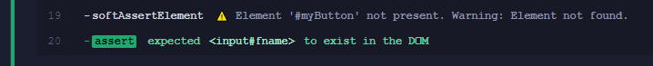

# cypress-plugin-check [![ci status][ci image]][ci url] [![renovate-app badge][renovate-badge]][renovate-app] 

> Cypress Plugin Check is a custom Cypress plugin that provides a convenient way to check if an element is present before performing actions like click, type, or other Cypress commands. It also supports soft assertions for gracefully handling missing elements.

### Note: Only Support with CSS Selectors and support cypress `click` and `type` commands ###

## Install

```
    npm i -D cypress-plugin-check
    # or
    yarn add -D cypress-plugin-check
```

## use

### Simple

To use the cypress-plugin-check in your Cypress tests, you need to register it in your project's commands.js file or any other location where you define custom Cypress commands. You can do this by adding the following line:
(cypress > support > e2e.js)

```js
    import 'cypress-plugin-check';
```
## Command: `checkElement`

The `checkElement` command allows you to check if an element is present before performing actions. It takes a CSS selector as a parameter and returns the element if found, or logs a warning message if the element is not present.

```js
    cy.checkElement(selector);
```
### Example Usage

```js
    cy.checkElement('#my-button').click();
    cy.checkElement('#my-input').type('Hello World');
```

### Output


## Command: `softAssertElement`

The `softAssertElement` command is a soft assertion that checks if an element is present. It logs a warning message if the element is not found, but it doesn't cause the test to fail. This is useful for gracefully handling missing elements during test execution.

```js
    cy.softAssertElement(selector);
```
### Example Usage

```js
    cy.softAssertElement('#myButton');
```

### Output



[ci image]: https://github.com/lasithdilshan20/cypress-plugin-check/workflows/ci/badge.svg?branch
[ci url]: https://github.com/lasithdilshan20/cypress-plugin-check/actions
[renovate-badge]: https://img.shields.io/badge/renovate-app-blue.svg
[renovate-app]: https://renovateapp.com/

## Author

Lasitha Wijenayake &lt;lasithdilshan20@gmail.com&gt; &copy; 2023

License: MIT - do anything with the code, but don't blame me if it does not work.

Support: if you find any problems with this module, email
[open issue](https://github.com/lasithdilshan20/cypress-plugin-check/issues) on Github

## MIT License

Copyright (c) 2022 Lasitha Wijenayake &lt;lasithdislahan20@gmail.com&gt;

Permission is hereby granted, free of charge, to any person
obtaining a copy of this software and associated documentation
files (the "Software"), to deal in the Software without
restriction, including without limitation the rights to use,
copy, modify, merge, publish, distribute, sublicense, and/or sell
copies of the Software, and to permit persons to whom the
Software is furnished to do so, subject to the following
conditions:

The above copyright notice and this permission notice shall be
included in all copies or substantial portions of the Software.

THE SOFTWARE IS PROVIDED "AS IS", WITHOUT WARRANTY OF ANY KIND,
EXPRESS OR IMPLIED, INCLUDING BUT NOT LIMITED TO THE WARRANTIES
OF MERCHANTABILITY, FITNESS FOR A PARTICULAR PURPOSE AND
NONINFRINGEMENT. IN NO EVENT SHALL THE AUTHORS OR COPYRIGHT
HOLDERS BE LIABLE FOR ANY CLAIM, DAMAGES OR OTHER LIABILITY,
WHETHER IN AN ACTION OF CONTRACT, TORT OR OTHERWISE, ARISING
FROM, OUT OF OR IN CONNECTION WITH THE SOFTWARE OR THE USE OR
OTHER DEALINGS IN THE SOFTWARE.